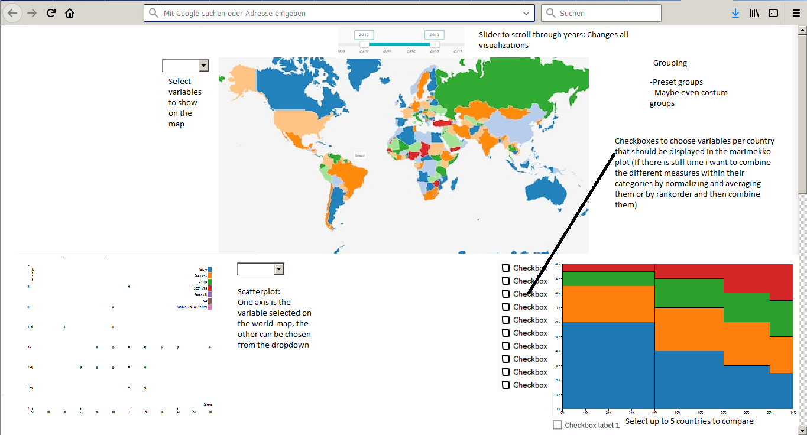

# World Atlas
*Phillip Kersten*

[Github pages](phpeke.github.io/worldAtlas/final.html)

Video:

https://vimeo.com/277771405

This project is aiming to show the difference between countries and groups of countries with respect to multiple variables concerning development, politics and conflict.
It is also possible to correlate different variables within a country or group countries and variables.

A lot of countries across the globe are selling and buying weapons. The trade in weapons is one of the largest markets   world wide with a total spending of 1.7 Trillion US-Dollars in 2016. Some critical voices are raising concerns that by selling weapons the rich countries indirectly exacerbate the bad humanitarian situation in poor and underdeveloped countries. This page shall be used as tool to get more information about the connection between the weapon business and the development of countries.

### Layout:

1. A map to show chosen data accross time and to select countries for comparison
  - Dropdown selection of variables to show

2. A scatterplot to correlate variables across all countries
  - Window to group countries in
  - Combine measures

3. A Marimekko-chart to compare multiple countries with each other on multiple variables
  - Checkbox for multiple variables
  - Button to enable selection of up to 5 countries on the map

### The variables are:
**MVP**

- Development/wealth
  - HDI (Human Development Index)
    - HDI per country
  - WDI (World development indicator)
    - Life expectancy at birth
    - GDP per capita

- Conflict
  - SIPRI
    - Arms imported/exported
    - % of armed forces in population
    - Military expenditure (% of GDP)
  - WDR (World development report)
    - Measures of war and terror

**Additional**

- Political situation
  - WDR (World development report 2011)
    - Democracy
      - Tutu Vanhanens index of democracy
  - WGI (World governance indicators)
    - Quality of the government
    - Corruption

## Additional:

### Countries can be grouped by:
- geographic location (e.g. continents)
- Political situation (democracy, autocracy, etc.)
- Development (1st, 2nd and 3rd world countries)

### Variables can be grouped and averaged within their categories:
- Weapons/armed forces
- Development
- politic situation
